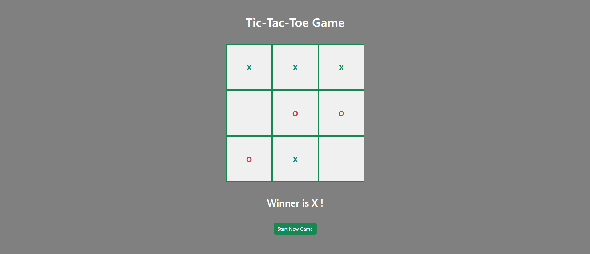

# Tic-tac-toe

This is a simple Tic-tac-toe game built using React and Vite. It allows two players to take turns marking spaces on a 3x3 grid, aiming to get three of their symbols (either 'X' or 'O') in a row, column, or diagonal.

### Features

- **Responsive design**: Playable on both desktop and mobile devices.
- **Local storage**: Game state is saved to local storage, allowing players to continue the game after closing or refreshing the browser.
- **Reset functionality**: Players can reset the game at any time to start over.
- **Basic styling**: Utilizes Bootstrap for basic styling, with additional custom styles for a pleasant user experience.

### Demo
Live view by clicking the link: https://game-tic-tac-toe-2024.netlify.app

You can also clone the project and open it in localhost, or enjoy the preview video below instead

https://github.com/olhasashchuk/tic-tac-toe-function/assets/128645346/a1830ada-6bfb-4541-9e80-33ac2cc43484

### Running
1. Clone the repo: git clone https://github.com/olhasashchuk/tic-tac-toe-function.git
2. npm install 
3. npm run dev 
4. The dev server will start on http://localhost:5173, and the game app will launch automatically.

### Contributing

Contributions are welcome! If you find any bugs or have suggestions for improvements, please open an issue or submit a pull request.
